# Architecture Overview

This document covers the AWS infrastructure and project-specific architectural decisions for this Next.js SST starter.

## Tech Stack

- **Next.js 15.3.2**: React framework with App Router
- **OpenNext v3.6.2**: Next.js deployment on AWS serverless
- **SST v3.17+**: Infrastructure as Code with type-safe resource linking
- **AWS**: CloudFront, Lambda (ARM64), S3, SES

## Infrastructure Flow

```
User Request → CloudFront → Lambda Function → SES (contact form)
              ↓
            S3 Bucket (static assets)
```

## AWS Components

### 1. CloudFront Distribution

- **Static Assets** (`/_next/static/*`): Cached for 1 year, served from S3
- **API Routes** (`/api/*`): No cache, routed to Lambda
- **Pages** (`/*`): Default routing to Lambda

### 2. Lambda Function

- **Architecture**: ARM64 (Graviton2) - 34% cost savings
- **Runtime**: Node.js 20.x
- **Memory**: 1024MB (configurable)
- **Cold Start**: ~100-150ms

### 3. S3 Bucket

- Stores Next.js build output (`/.next/static/`)
- Secured via CloudFront Origin Access Control

### 4. SES (Simple Email Service)

- Handles contact form submissions
- Domain identity with DMARC policy

## Project-Specific Configurations

### SST Resource Linking

Type-safe resource access:

```typescript
// src/typings/sst-env.d.ts (manually maintained)
declare module "sst" {
  export interface Resource {
    NextEmail: { type: "sst.aws.Email"; sender: string };
    SupportEmail: { type: "sst.aws.Email"; sender: string };
  }
}

// Usage in code
import { Resource } from "sst";
const contactEmail = Resource.SupportEmail.sender;
```

### Environment Management

```typescript
// src/lib/env.utils.ts
getDeploymentEnv(); // "dev" or "prod"
isDeploymentEnv("prod"); // boolean check
```

### Lambda Warming Optimization

**Issue**: SST's default 5-minute warm period causes frequent cold starts.

**Solution**: Custom `warmer.js` with 1-minute intervals (see [SST #5534](https://github.com/sst/sst/issues/5534)):

```javascript
// warmer.js - Custom warming script
const URL_TO_VISIT = "https://pinref.com";
const CONCURRENT_VISITS = 100;

// Run every 1 minute instead of default 5 minutes
setInterval(runConcurrentVisits, 60 * 1000);
```

**Usage**:

1. Update `URL_TO_VISIT` to your domain
2. Run: `node warmer.js`
3. Keeps Lambda warm with minimal cost

### Email Configuration Steps

1. **Configure domain identity** in `sst.config.ts`:

   ```typescript
   const domainIdentity = new sst.aws.Email("NextEmail", {
     sender: domainName,
     dmarc: "v=DMARC1; p=quarantine; adkim=s; aspf=s;",
   });
   ```

2. **Set contact email** in `src/constants.tsx`:

   ```typescript
   export const CONTACT_EMAIL = "support@pinref.com";
   ```

3. **Deploy and verify** email identity in AWS Console

4. **Update DNS records** (if using custom domain)

## Deployment Configurations

### With Custom Domain

```typescript
// sst.config.ts
const domainName = isProd($app.stage) ? "pinref.com" : `${$app.stage}.pinref.com`;

new sst.aws.Nextjs("NextApp", {
  domain: {
    name: domainName,
    dns: sst.aws.dns({ zone: "YOUR_HOSTED_ZONE_ID" }),
  },
  // ...
});
```

### Domain-less Deployment

```typescript
// sst.config.ts - Remove domain config for development
new sst.aws.Nextjs("NextApp", {
  // No domain config - uses CloudFront default domain
  server: { architecture: "arm64" },
  environment: { DEPLOYMENT_ENV: $app.stage },
  link: [...identities],
});
```

## Performance Characteristics

### Cold Start Optimization

- **ARM64**: 100-150ms cold start
- **x86_64**: 150-200ms cold start
- **Warm requests**: 3-5ms response time

### Cost Optimization

- **ARM64 Graviton2**: 34% cost savings
- **Serverless pricing**: Pay per request
- **CloudFront caching**: Reduces Lambda invocations

### Bundle Optimization

- **Tree shaking**: Removes unused code
- **Code splitting**: Route-based chunks
- **Compression**: Brotli for smaller payloads

## Deployment Stages

```bash
npx sst deploy --stage dev   # Development environment
npx sst deploy --stage prod  # Production environment
```

**Stage Behavior**:

- **Development**: Resources removed when stage destroyed
- **Production**: Resources retained (`removal: "retain"`)

## Incremental Static Regeneration (ISR)

Basic ISR setup for pages that need periodic updates:

```typescript
// src/app/some-page/page.tsx
export const revalidate = 3600; // Revalidate every hour

export default async function Page() {
  const data = await fetch('https://api.example.com/data');
  return <div>{/* content */}</div>;
}
```

**OpenNext ISR Features**:

- S3-based cache storage
- On-demand revalidation via API
- Tag-based cache invalidation

## Monitoring

### Built-in AWS Monitoring

- **CloudWatch Logs**: Lambda execution logs
- **CloudWatch Metrics**: Performance metrics
- **Cost Explorer**: Usage tracking

### Development Tools

- **SST Console**: Live function logs during `sst dev`
- **Next.js Analyzer**: Bundle size monitoring

## Infrastructure Diagrams

### AWS Resource Relationships

```mermaid
graph TB
    User[👤 User] --> CF[☁️ CloudFront Distribution]

    CF --> S3[🗄️ S3 Bucket<br/>Static Assets]
    CF --> Lambda[⚡ Lambda Function<br/>SSR & API Routes]
    CF --> Edge[🔄 Lambda@Edge<br/>Middleware]

    Lambda --> SES[📧 Amazon SES<br/>Email Service]

    subgraph "Custom Domain (Optional)"
        R53[🌐 Route53<br/>DNS]
        ACM[🔒 ACM Certificate<br/>SSL/TLS]
        R53 --> CF
        ACM --> CF
    end

    subgraph "Monitoring & Logs"
        CW[📊 CloudWatch<br/>Logs & Metrics]
        Lambda --> CW
        CF --> CW
    end

    subgraph "Development"
        SST[🛠️ SST CLI<br/>Infrastructure as Code]
        SST --> CF
        SST --> Lambda
        SST --> S3
        SST --> SES
    end
```



### Request Flow Architecture


## Current Compatibility

### Stack Versions

- **OpenNext**: v3.6.2 (supports Next.js 15.3.2)
- **Next.js**: 15.3.2 with App Router
- **SST**: v3.17+ with enhanced Next.js construct
- **Node.js**: 20.x (ARM64 recommended)

### Key Project Features

- ✅ Contact form with Server Actions and SES integration
- ✅ App Router with TypeScript support
- ✅ Turbopack development mode
- ✅ Environment variables through SST resource linking
- ✅ AWS SES email functionality with verification

### Project-Specific Edge Cases

1. **Windows Development**: Docker setup required for SST initialization
2. **Email Verification**: SES requires email verification in sandbox mode
3. **Build Process**: Stop SSO script before running builds (terminal conflicts)
4. **Environment Variables**: Use SST linking instead of manual env management

## Troubleshooting Common Issues

### 1. Cold Starts

- **Symptoms**: Slow first request after idle period
- **Solutions**: Use `warmer.js` script, consider provisioned concurrency for high-traffic

### 2. Bundle Size

- **Symptoms**: Slow deployments, large Lambda packages
- **Solutions**: Dynamic imports, proper tree shaking, bundle analysis

### 3. CORS Issues

- **Symptoms**: Browser blocking API requests
- **Solutions**: Proper CORS configuration in Next.js API routes

### 4. Email Delivery Issues

- **Symptoms**: Contact form not sending emails
- **Solutions**: Verify SES identities, check CloudWatch logs, validate DMARC records

---

_For complete setup instructions, see [AWS Deployment Guide](./aws-deployment.md). For development tools, see [Development Setup](./development-setup.md)._
