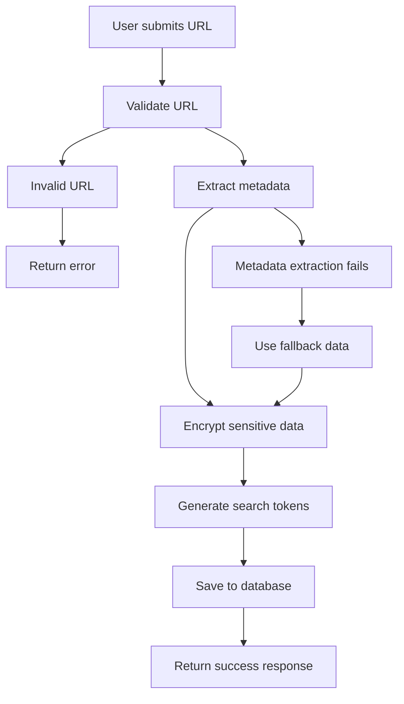
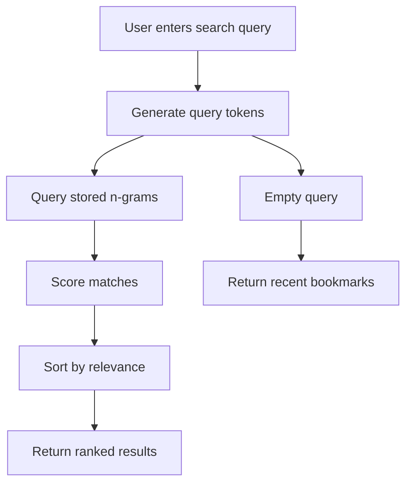

# Business Logic & Features

## Core Domain Entities

### User
The central entity representing an application user.

```typescript
interface User {
  id: string;           // Unique identifier
  email: string;        // Primary authentication credential
  name?: string;        // Display name
  image?: string;       // Profile image URL
  createdAt: string;    // Account creation timestamp
  updatedAt: string;    // Last modification timestamp
}
```

**Business Rules:**
- Each user has isolated data access
- Email serves as the primary identifier
- User data is never shared across accounts
- Accounts can be created via OAuth or email/password

### Bookmark
The primary content entity representing a saved web link.

```typescript
interface Bookmark {
  id: string;               // Unique identifier
  userId: string;           // Owner reference
  url: string;              // Original URL (encrypted)
  title?: string;           // Page title (encrypted)
  description?: string;     // Page description (encrypted)
  image?: string;           // Preview image URL
  favicon?: string;         // Site favicon URL
  domain?: string;          // Domain name (not encrypted, used for search)
  categoryId?: string;      // Optional category assignment
  tagIds: string[];         // Associated tag IDs
  isFavorite: boolean;      // Favorite status
  searchTokens: string[];   // Pre-computed search n-grams
  createdAt: string;        // Creation timestamp
  updatedAt: string;        // Last modification timestamp
}
```

**Business Rules:**
- URLs must be valid HTTP/HTTPS addresses
- Metadata is automatically extracted when possible
- Sensitive data (title, description, URL) is encrypted at rest
- Each bookmark can belong to one category but multiple tags
- Search tokens are generated automatically for fast retrieval
- Users can only access their own bookmarks

### Category
Hierarchical organization entity for grouping bookmarks.

```typescript
interface Category {
  id: string;           // Unique identifier
  userId: string;       // Owner reference
  name: string;         // Category name (encrypted)
  icon: string;         // Emoji or icon representation
  color: string;        // Hex color code for UI
  createdAt: string;    // Creation timestamp
  updatedAt: string;    // Last modification timestamp
}
```

**Business Rules:**
- Category names must be unique per user
- Categories are single-level (no nested hierarchies)
- Each category has a visual icon and color
- Deleting a category doesn't delete associated bookmarks
- Categories are private to each user

### Tag
Flexible labeling entity for cross-cutting bookmark organization.

```typescript
interface Tag {
  id: string;           // Unique identifier
  userId: string;       // Owner reference
  name: string;         // Tag name
  icon?: string;        // Optional emoji or icon
  createdAt: string;    // Creation timestamp
  updatedAt: string;    // Last modification timestamp
}
```

**Business Rules:**
- Tag names must be unique per user
- Tags are many-to-many with bookmarks
- Tags are more flexible than categories
- Popular tags can be suggested to users
- Tags are private to each user

## Core Business Processes

### Bookmark Creation Workflow



**Process Steps:**
1. **URL Validation**: Ensure the URL is properly formatted and accessible
2. **Metadata Extraction**: Scrape title, description, images, and favicon
3. **Data Encryption**: Encrypt sensitive fields using user-specific keys
4. **Search Token Generation**: Create n-grams for fuzzy search capabilities
5. **Database Storage**: Save encrypted bookmark with metadata
6. **Response**: Return bookmark data to user interface

**Error Handling:**
- Invalid URLs return validation errors
- Inaccessible URLs use domain as fallback title
- Encryption failures trigger system alerts
- Database errors are retried with exponential backoff

### Search Algorithm



**Scoring Algorithm:**
```typescript
function calculateScore(queryTokens: string[], bookmarkTokens: string[]): number {
  let score = 0;
  
  for (const queryToken of queryTokens) {
    for (const bookmarkToken of bookmarkTokens) {
      if (bookmarkToken === queryToken) {
        score += 10; // Exact match
      } else if (bookmarkToken.startsWith(queryToken)) {
        score += 5;  // Prefix match
      } else if (bookmarkToken.includes(queryToken)) {
        score += 1;  // Partial match
      }
    }
  }
  
  return score;
}
```

**Search Features:**
- **Fuzzy Matching**: Handles typos and partial queries
- **Multi-field Search**: Searches title, description, domain, and URL
- **Real-time Results**: Updates as user types
- **Relevance Ranking**: Most relevant results appear first
- **Performance**: Sub-100ms response times for most queries

### Category and Tag Management

**Category Operations:**
- **Create**: Validate uniqueness, assign colors and icons
- **Update**: Modify name, icon, or color
- **Delete**: Remove category but preserve bookmarks
- **List**: Return all user categories with bookmark counts

**Tag Operations:**
- **Create**: Validate uniqueness, optional icon assignment
- **Update**: Modify name or icon
- **Delete**: Remove tag and all associations
- **List**: Return all user tags with bookmark counts
- **Suggest**: Recommend popular tags based on bookmark content

### Filtering and Organization

**Filter Types:**
- **Category Filter**: Show bookmarks from specific category
- **Tag Filter**: Show bookmarks with specific tag
- **Favorites Filter**: Show only favorited bookmarks
- **Combined Filters**: Apply multiple filters simultaneously

**Sorting Options:**
- **Date Added**: Newest or oldest first
- **Alphabetical**: By title A-Z or Z-A
- **Domain**: Group by website domain
- **Favorites**: Favorites first, then by date

## Data Flow Examples

### Adding a New Bookmark

```
1. User pastes URL: "https://react.dev/learn"
2. System validates URL format ✓
3. Metadata extraction:
   - Title: "Learn React"
   - Description: "Learn React with our step-by-step guide"
   - Domain: "react.dev"
   - Favicon: "https://react.dev/favicon.ico"
4. Encryption:
   - title: encrypt("Learn React") → "AES256_ENCRYPTED_DATA"
   - description: encrypt("Learn React with...") → "AES256_ENCRYPTED_DATA"
   - url: encrypt("https://react.dev/learn") → "AES256_ENCRYPTED_DATA"
5. Search token generation:
   - ["l", "le", "lea", "lear", "learn", "r", "re", "rea", "reac", "react", "learn react"]
6. Database storage with all fields
7. UI updates with new bookmark card
```

### Searching for Bookmarks

```
1. User types: "reac tuto"
2. Query token generation: ["reac", "tuto", "r", "re", "rea", "t", "tu", "tut"]
3. DynamoDB scan for matching tokens
4. Score calculation for each match:
   - "React Tutorial": score = 15 (prefix matches)
   - "Creating React Apps": score = 10 (partial matches)
   - "JavaScript React": score = 5 (partial match)
5. Sort by score descending
6. Return top 20 results
7. UI displays ranked bookmark cards
```

### Organizing with Categories and Tags

```
1. User creates category:
   - Name: "Frontend Development"
   - Icon: "💻"
   - Color: "#3b82f6"
2. User creates tags:
   - "React"
   - "Tutorial"
   - "Documentation"
3. User assigns bookmark to category and tags
4. Bookmark becomes filterable by:
   - Category: "Frontend Development"
   - Tags: "React", "Tutorial", "Documentation"
5. Sidebar updates with category/tag counts
```

## Business Rules and Constraints

### Data Validation
- **URLs**: Must be valid HTTP/HTTPS format
- **Category Names**: 1-50 characters, unique per user
- **Tag Names**: 1-30 characters, unique per user
- **Icons**: Single emoji or 1-5 character string
- **Colors**: Valid hex color codes

### Security Rules
- **User Isolation**: Users can only access their own data
- **Encryption**: All sensitive bookmark data encrypted at rest
- **Authentication**: All API endpoints require valid session
- **Rate Limiting**: Prevent abuse with request rate limits

### Performance Rules
- **Search Results**: Limited to 50 results for performance
- **N-gram Limits**: Maximum 1000 tokens per bookmark
- **Batch Operations**: Process up to 25 items per batch
- **Cache TTL**: Static data cached for 1 hour

### Business Logic Rules
- **Bookmark Limits**: Free users limited to 500 bookmarks (configurable)
- **Category Limits**: Maximum 50 categories per user
- **Tag Limits**: Maximum 100 tags per user
- **Favorite Limits**: No limit on favorites
- **Export Limits**: Full export once per day

## Integration Points

### Browser Extension (Future)
- **Quick Save**: Save current page with one click
- **Smart Tagging**: Suggest tags based on page content
- **Duplicate Detection**: Warn when URL already bookmarked
- **Bulk Import**: Import existing browser bookmarks

### Mobile App (Future)
- **Offline Access**: Sync bookmarks for offline viewing
- **Share Integration**: Save links shared from other apps
- **Voice Search**: Voice-activated bookmark search
- **Push Notifications**: Alerts for important bookmarks

### API Integration (Future)
- **REST API**: Full CRUD operations for third-party tools
- **Webhooks**: Real-time notifications for bookmark changes
- **Import/Export**: Bulk data operations
- **Analytics**: Usage tracking and insights

---

This business logic forms the foundation of Pinref's core functionality, providing users with powerful tools to organize, search, and manage their web bookmarks effectively.
